# Basic Router Configuration

## Objective

- Move between modes of the router CLI
- Erase the configuration of the router, reload the router, and enter the initial configuration dialog
- Configure the hostname
- Configure the enable secret/password and console password
- Encrypt the passwords in the configuration
- Configure the IP address of a router interface
- Save the configuration

## Diagram

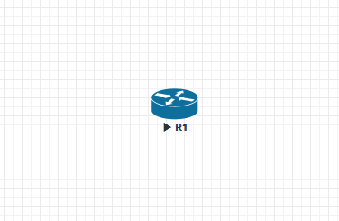

## Instructions

### 1. Start the router

After starting the router, you will see the following message:

```plaintext
--- System Configuration Dialog ---

Would you like to enter the initial configuration dialog? [yes/no]: 
```

Type `no` and press `Enter`.

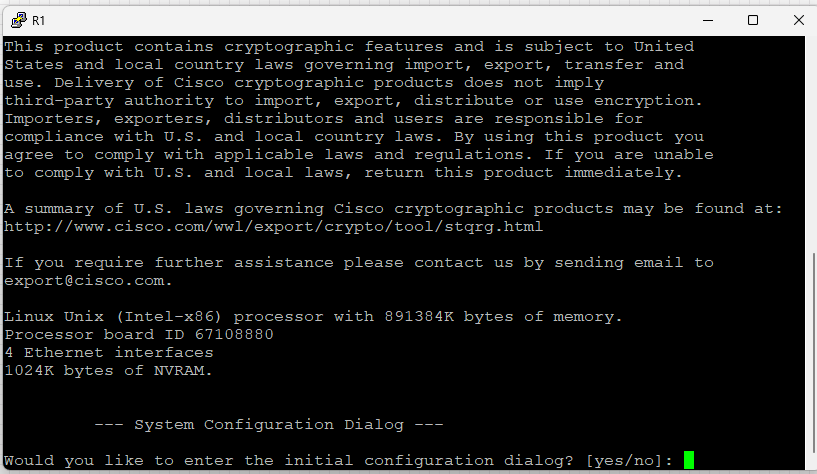

### 2. Move between modes of the router CLI

> We have three main modes in the router CLI:
>
> - User mode
> - Privileged mode
> - Global configuration mode

After typing `no` and pressing `Enter` in the previous step, you will see the following prompt:

```plaintext
Router>
```

This is the user mode prompt. To enter the privileged mode, type `enable` and press `Enter`.

```plaintext
Router>enable
```

You will see the following prompt:

```plaintext
Router#
```

This is the privileged mode prompt. To enter the global configuration mode, type `configure terminal` and press `Enter`.

```plaintext
Router#configure terminal
```

You will see the following prompt:

```plaintext
Router(config)#
```

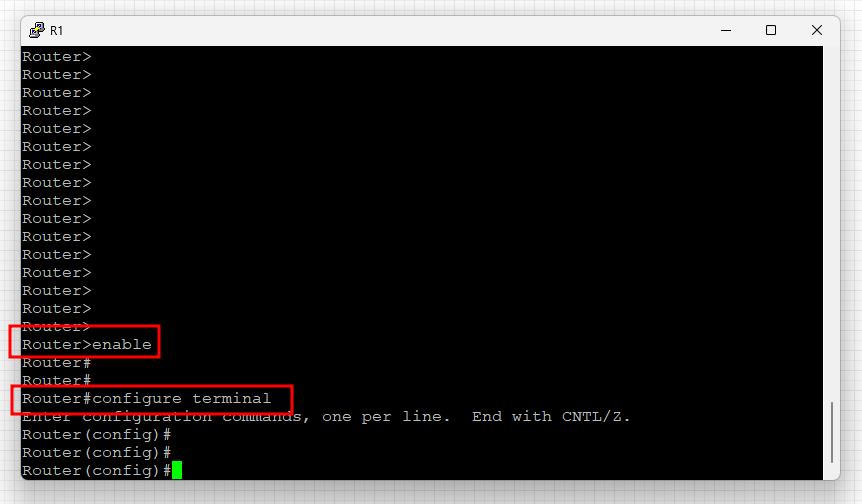

In the global configuration mode, you can configure the router settings and move to the other sub-modes (e.g., interface configuration mode).

```plaintext
Router(config)#interface FastEthernet0/0
Router(config-if)#
```

Use the command `exit` and `disable` to move back to the global configuration mode and user mode, respectively.

```plaintext
Router(config-if)#exit
Router(config)#
Router(config)#exit
Router#
Router#disable
Router>
```

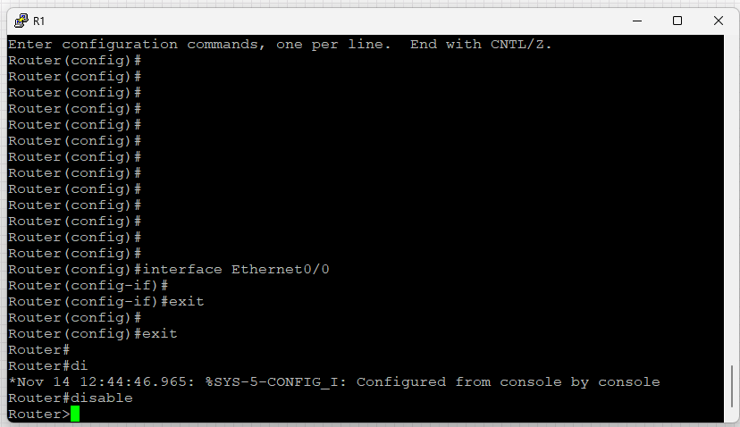

Or use the command `end` or `Ctrl+Z` to move directly to the privileged mode from any sub-mode.

```plaintext
Router(config-if)#end
Router#
```

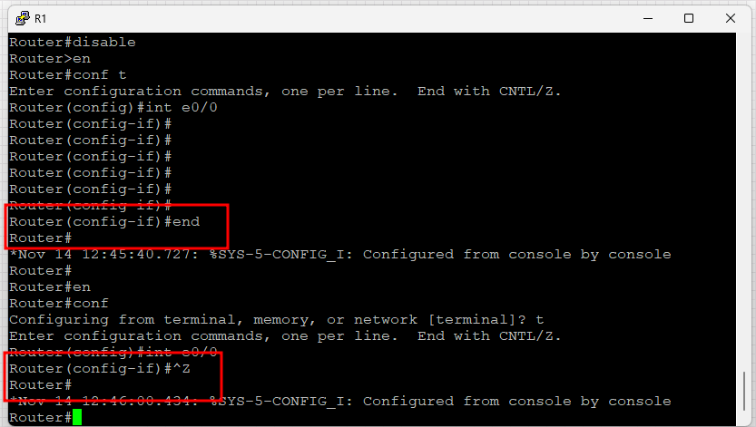

### 3. Erase the configuration of the router, reload the router, and enter the initial configuration dialog

First step when configuring a new router is to erase the existing configuration. To do this, enter the privileged mode and use the command `erase startup-config`.

```plaintext
Router#erase startup-config
```

You will see the following message:

```plaintext
Erasing the nvram filesystem will remove all files! Continue? [confirm]
```

Type `confirm` or nothing and press `Enter`.

```plaintext
Erase of nvram: complete
Router#
```

Now, reload the router using the command `reload`.

```plaintext
Router#reload
```

You will see the following message:

```plaintext
System configuration has been modified. Save? [yes/no]: 
```

Type `no` and press `Enter`. You will see the following message:

```plaintext
Proceed with reload? [confirm]
```

Type `confirm` or nothing and press `Enter`. The router will reload.

After the router reloads, you will see the following message:

```plaintext
--- System Configuration Dialog ---
Would you like to enter the initial configuration dialog? [yes/no]: 
```

Type `no` and press `Enter` like in the first step.

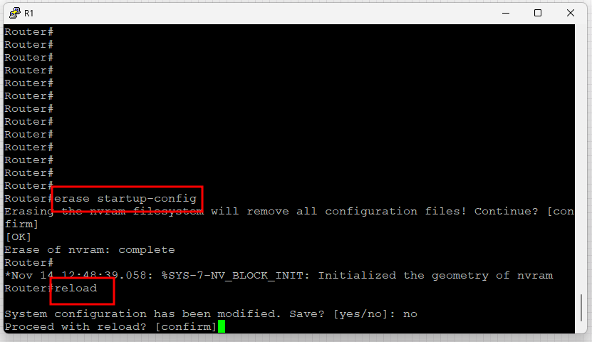

### 4. Configure the hostname

In the global configuration mode, use the command `hostname` followed by the hostname you want to set.

```plaintext
Router(config)#hostname R1
R1(config)#
```

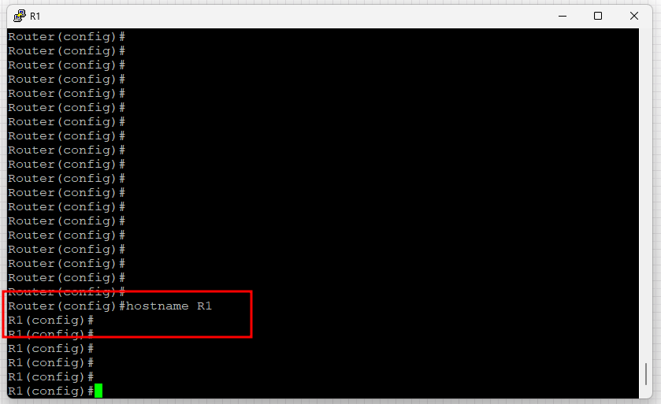

### 5. Configure the enable secret/password and console password

Enable secret/password is used to enter the privileged mode. We have two types of passwords: plain text and encrypted.

- `enable password` is the plain text password. It is not recommended to use this password.
- `enable secret` is the encrypted password. It is recommended to use this password.

> If you use both `enable password` and `enable secret`, the `enable secret` will be used and the `enable password` will be ignored.
>
> `enable password` will be used only if there is no `enable secret`

```plaintext
R1(config)#enable secret 123
```

Check if the `enable secret` is working by entering the privileged mode from the user mode.

```plaintext
R1>enable
Password: 123 <- Type the enable secret password (it will not be shown)
R1#
```

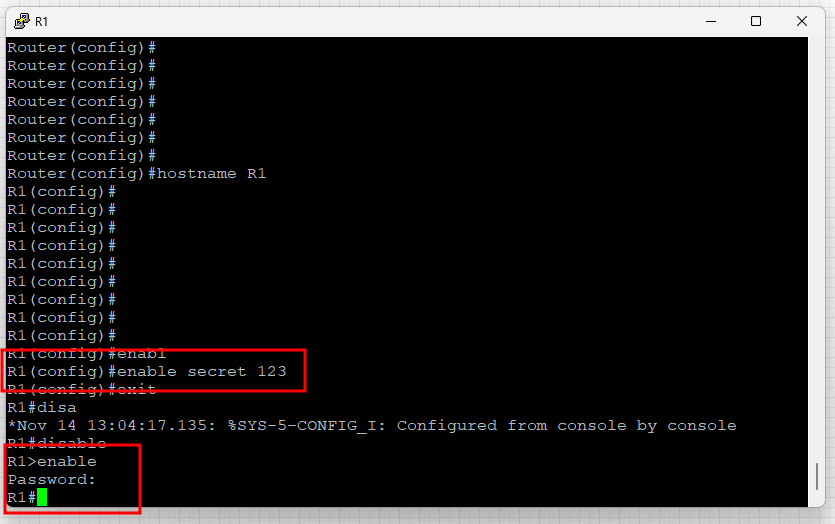

Console password is used to enter the privileged mode from the console port. Use the command `line console 0` to configure the console port.

```plaintext
R1(config)#line console 0
R1(config-line)#
```

Use the command `password` followed by the password you want to set.

```plaintext
R1(config-line)#password 123
```

Use the command `login` to enable the password.

```plaintext
R1(config-line)#login
```

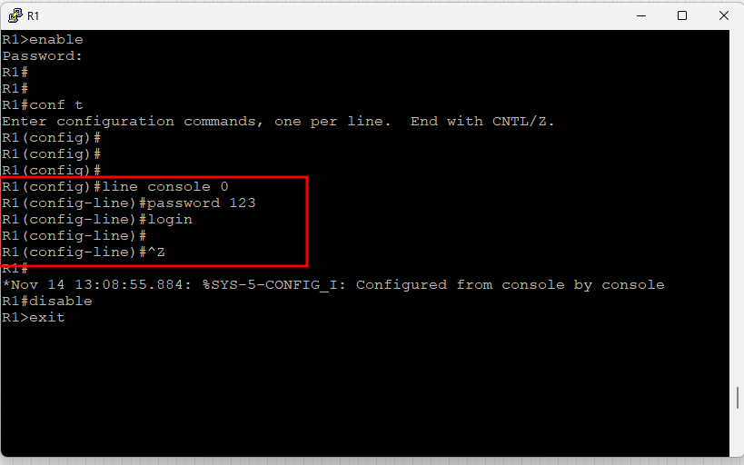

Check if the console password is working by exit the User mode and enter it again.

```plaintext
R1>exit
R1 con0 is now available
Password: 123 <- Type the console password
R1#
```

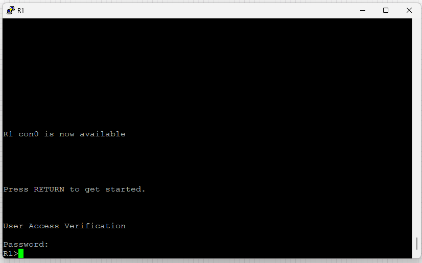

### 6. Encrypt the passwords in the configuration

> Checking the configuration file, you will see the passwords in plain text.

```plaintext
R1#show running-config
Building configuration...
(...)
enable secret 5 $1$<hash> <- Encrypted password
(...)

line con 0
 password 123 <- Plain text password
 login
(...)
```

Use the command `service password-encryption` to encrypt the passwords in the configuration.

```plaintext
R1(config)#service password-encryption
R1(config)#
```

Check the configuration file again.

```plaintext
R1#show running-config
Building configuration...
(...)
enable secret 5 $1$<hash> <- Encrypted password
(...)
line con 0
 password 7 <number> <- Encrypted password
 login
(...)
```

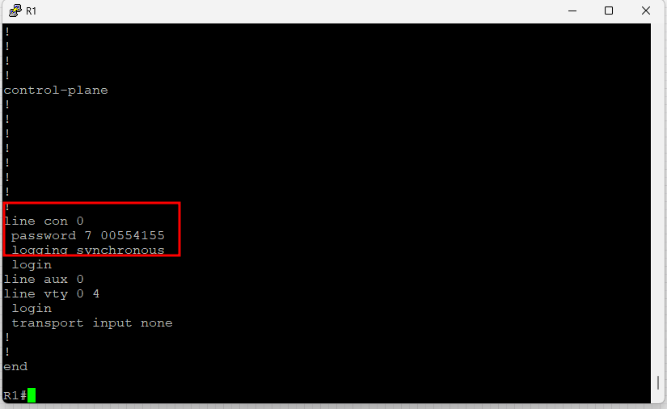

### 7. Configure the IP address of a router interface

In the global configuration mode, use the command `interface` followed by the interface you want to configure.

```plaintext
R1(config)#interface FastEthernet0/0
R1(config-if)#
```

Use the command `ip address` followed by the IP address and subnet mask you want to set.

```plaintext
R1(config-if)#ip address 192.168.1.1 255.255.255.0
```

Use the command `no shutdown` to enable the interface.

```plaintext
R1(config-if)#no shutdown
```

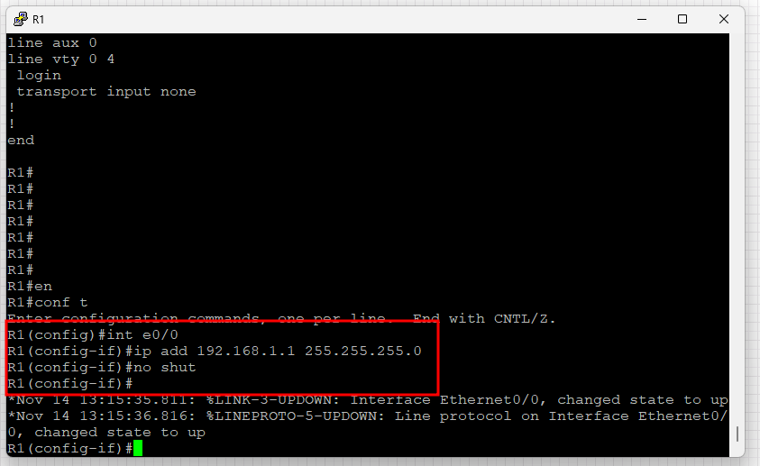

After configuring the IP address, you can check the interface status using the command `show ip interface brief`.

```plaintext
R1#show ip interface brief
```

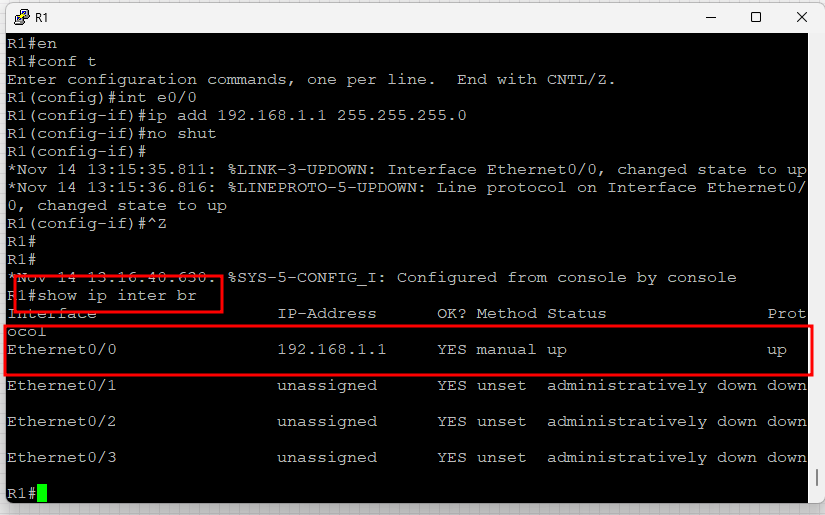

### 8. Save the configuration

After configuring the router, save the configuration using the command `write memory` or `copy running-config startup-config`.

```plaintext
R1#write memory
```

or

```plaintext
R1#copy running-config startup-config
```

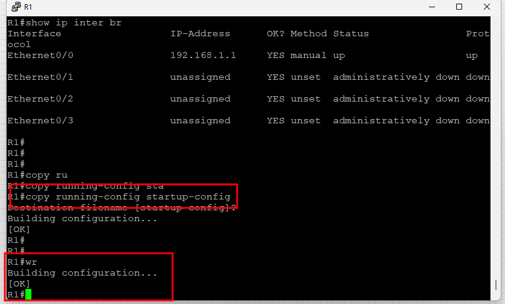
