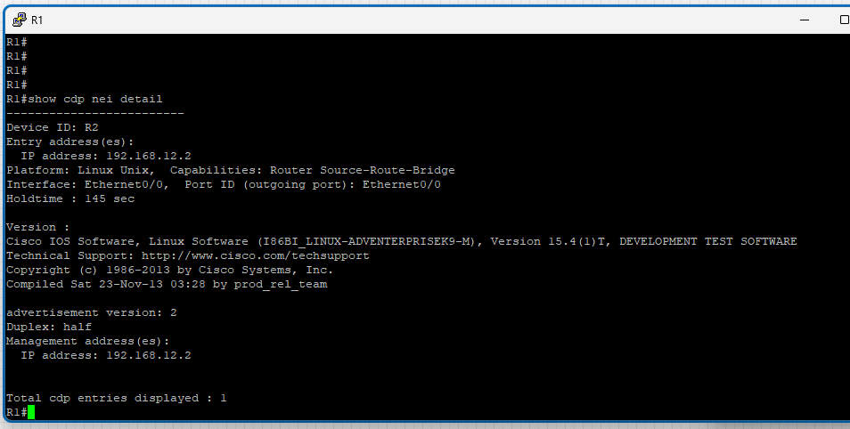

# Configure CDP and Telnet

## Objectives

- Connect two routers and set the IP addresses.
- Show the CDP neighbors.
- Configure Telnet on the routers.

## Topology


## Instructions

### 1. Connect the routers as shown in the topology

### 2. Set the IP addresses on the routers as shown in the topology

### 3. Show the CDP neighbors

From R1, show the CDP neighbors:

```plaintext
R1# show cdp neighbors
```


Explanation:

- `Device ID`: The name of the device. In this case, it is R2.
- `Local Intrfce`: The interface on R1 that is connected to R2. In this case, it is `Eth 0/0`.
- `Holdtime`: The amount of time in seconds that the device will hold the information before discarding it. In this case, it is 174 seconds.
- `Capability`: The type of device. In this case, it is a router and it is source route bridging capable.
- `Platform`: The model of the device. In this case, it is a Linux Uni.
- `Port ID`: The interface on R2 that is connected to R1. In this case, it is `Eth 0/0`.

Show more detailed information about the neighbor:

```plaintext
R1# show cdp neighbors detail
```



This command will show more detailed information about the neighbor, such as the IP address, the version of the software, and the duplex mode, .etc.

`It can be also used to show the neighbors on R2.`

> Note: CDP is a Cisco proprietary protocol that is used to discover information about directly connected Cisco devices. It is enabled by default on Cisco devices.

### 4. Configure Telnet on the routers

Configure Telnet on R1:

```plaintext
R1(config)# line vty 0 4
R1(config-line)# password 123
R1(config-line)# transport input telnet <- This command allows the router to accept telnet connections.
R1(config-line)# login
R1(config-line)# exit
R1(config)# exit
```

Configure Telnet on R2:

```plaintext
R2(config)# line vty 0 4
R2(config-line)# password 123
R1(config-line)# transport input telnet <- This command allows the router to accept telnet connections.
R2(config-line)# login
R2(config-line)# exit
R2(config)# exit
```


Explanation:

- `line vty 0 4`: This command enters the configuration mode for the virtual terminal lines.
- `password 123`: This command sets the password for the virtual terminal lines to `123`.
- `transport input telnet`: This command allows the router to accept telnet connections.
- `login`: This command enables password checking for the virtual terminal lines.

### 5. Test the Telnet connection

From the R1, telnet to R2, enter the password `123` when prompted and you should be able to access the R2.

```plaintext
R1# telnet 192.168.12.2
```


From R2, telnet to R1, and from R1, show the list of users (contains the telnet connection).

```plaintext
R2# show users
```


Explanation:

- `Line`: The line number that the user is connected to. The `con 0` is the console port, and the `vty 0` is the virtual terminal line.
- `User`: The username of the user.
- `Idle`: The amount of time in minutes that the user has been idle.
- `Location`: The IP address of the user.

From R1, it can disconnect the user by using the following command:

```plaintext
R1# clear line <ID> <- The ID is the line number.

Or

R1# clear line vty <ID> <- The ID is the virtual terminal line number.
```

We can leave the telnet session without disconnecting by pressing `Ctrl + Shift + 6` and then pressing `x`. This will put the telnet session in the background.

If we have multiple telnet sessions, we can show all the sessions by using the following command:

```plaintext
R1# show sessions
```

This command will show all the telnet sessions that are currently active.

To connect to a specific session, we can use the following command:

```plaintext
R1# resume <ID> <- The ID is the session number.
```


This command will bring the telnet session to the foreground.

To disconnect from a specific session, we can use the following command:

```plaintext
R1# disconnect <ID> <- The ID is the session number.
```


This command will disconnect the telnet session.
