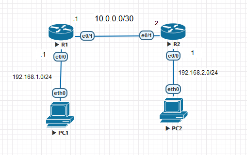

# Configure DHCP on a Cisco Router

## Objectives

- Basic router configuration
- DHCP configuration:
  - R1 and R2 are DHCP servers for their respective networks
  - R1 is the DHCP server, R2 is the DHCP relay.

## Topology



## Instructions

### 1. Basic router configuration

- Configure the routers like the first lab. You can find the instructions [here](/CCNA/Basic%20Router%20Config/README.md).
  - Hostname
  - Enable secret password
  - Console password
  - VTY password
  - IP address on the interfaces
  - .etc

### 2. DHCP configuration

#### a. Case 1: R1 and R2 are DHCP servers for their respective networks

On R1, create a DHCP pool for the 192.168.1.0/24 network:

```plaintext
R1(config)# ip dhcp pool LAN1
R1(dhcp-config)# network 192.168.1.0 255.255.255.0
R1(dhcp-config)# default-router 192.168.1.1
R1(dhcp-config)# dns-server 8.8.8.8
R1(dhcp-config)# exit
```

Use the `ip dhcp excluded-address` command to exclude the IP addresses that don't use for the DHCP pool:

```plaintext
R1(config)# ip dhcp excluded-address 192.168.1.1 192.168.1.10
```


After configuring the DHCP pool, on the PC1 (VPC), set the IP address to DHCP:

```plaintext
PC1> ip dhcp
```


Do the same for R2 and PC2.


Show the DHCP bindings (List of IP addresses that have been leased to clients):

```plaintext
R1# show ip dhcp binding
```


#### b. Case 2: R1 is the DHCP server, R2 is the DHCP relay

Do the same configuration as the first case, but on R2, configure the DHCP relay:

```plaintext
R2(config)# interface Ethernet0/1
R2(config-if)# ip helper-address 10.0.0.1 <- R1's IP address
```

And on R1, create a DHCP pool for the LAN2 192.168.2.0/24 network:

```plaintext
R1(config)# ip dhcp pool LAN2
R1(dhcp-config)# network 192.168.2.0 255.255.255.0
R1(dhcp-config)# default-router 192.168.2.1
R1(dhcp-config)# dns-server 8.8.8.8
R1(dhcp-config)# exit
```

We must also configure the static route on R1 to reach the 192.168.2.0/24 network:

```plaintext
R1(config)# ip route 192.168.2.0 255.255.255.0 10.0.0.2 <- R2's IP address
```


Then, on PC2, set the IP address to DHCP:

```plaintext
PC2> ip dhcp
```

Show the DHCP bindings on R1:

```plaintext
R1# show ip dhcp binding
```


