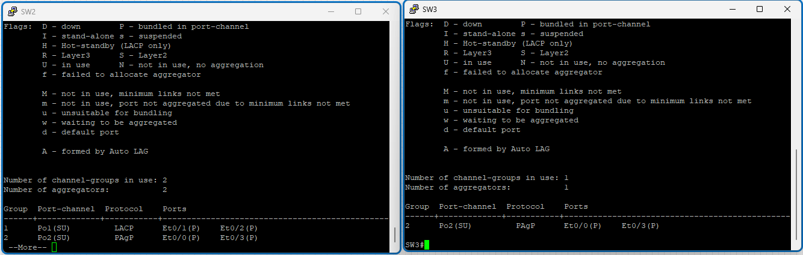

# Configure Etherchannel

## Objectives

- Basic Switch Configuration
- Etherchannel Configuration
  - SW1 and SW2: Etherchannel with LACP
  - SW2 and SW3: Etherchannel with PAgP

## Topology


## Instructions

### 1. Basic Switch Configuration

### 2. Etherchannel Configuration

> Etherchannel is a technology that allows multiple physical links to be bundled into a single logical link. This provides redundancy and increased bandwidth.
> Max number of links in an Etherchannel is 8.

#### SW1 and SW2: Etherchannel with LACP

> LACP has two modes: active and passive. Active mode will actively try to negotiate an Etherchannel, while passive mode will wait for the other side to initiate the negotiation.

Configure Etherchannel between SW1 and SW2 using LACP. SW1 will be in active mode, while SW2 will be in passive mode.

```plaintext
SW1:
interface range Ethernet0/1 - 2
    channel-protocol lacp
    channel-group 1 mode active
    exit

SW2:
interface range Ethernet0/1 - 2
    channel-protocol lacp
    channel-group 1 mode passive
    exit
```


Show the Etherchannel status on SW1 and SW2.

```plaintext
SW1# show etherchannel summary
SW2# show etherchannel summary
```


#### SW2 and SW3: Etherchannel with PAgP

> PAgP is a Cisco proprietary protocol that can only be used on Cisco devices. It has two modes: desirable and auto. Desirable mode will actively try to negotiate an Etherchannel, while auto mode will wait for the other side to initiate the negotiation.

Configure Etherchannel between SW2 and SW3 using PAgP. SW2 will be in desirable mode, while SW3 will be in auto mode.

```plaintext
SW2:
interface range Ethernet0/0, Ethernet0/3
    channel-protocol pagp
    channel-group 2 mode desirable
    exit

SW3:
interface range Ethernet0/0, Ethernet0/3
    channel-protocol pagp
    channel-group 2 mode auto
    exit
```


Show the Etherchannel status on SW2 and SW3.

```plaintext
SW2# show etherchannel summary
SW3# show etherchannel summary
```



