# Configure HSRP

## What is HSRP?

HSRP (Hot Standby Router Protocol) is a Cisco proprietary protocol that provides redundancy for a router in a network. It is used to provide a virtual IP address that can be used as the default gateway for hosts on the network. HSRP allows for two or more routers to work together in a group, with one router acting as the active router and the other routers acting as standby routers. If the active router fails, one of the standby routers will take over as the active router.

## How does HSRP work?

HSRP works by having the routers in the group elect an active router based on a priority value. The router with the highest priority value will become the active router. If two routers have the same priority value, the router with the highest IP address will become the active router. The active router will then send periodic hello messages to the standby routers to let them know that it is still active. If the active router fails to send hello messages, the standby routers will elect a new active router.

## Objectives

In this lab, you will configure HSRP on two routers to provide redundancy for a network. You will configure the routers to work together in a group, with one router acting as the active router and the other router acting as the standby router. You will also configure a virtual IP address that can be used as the default gateway for hosts on the network.

## Topology

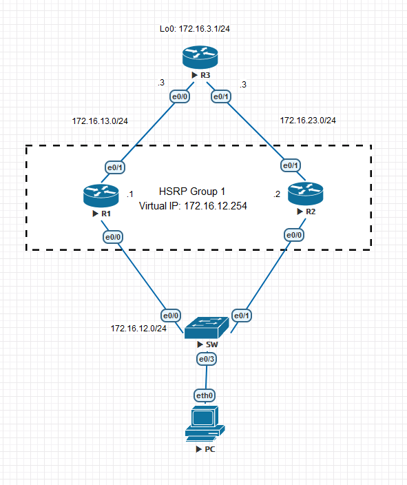

## Instructions

### Step 1: Configure the routers

Configure the routers with the settings shown in the topology diagram.

### Step 2: Configure Static Routes

Configure static routes on the routers to allow `R1` and `R2` to communicate with `172.16.3.0/24` subnet on the `R3` router.

```plaintext
R1(config)# ip route 172.16.3.0 255.255.255.0 172.16.13.3
R2(config)# ip route 172.16.3.0 255.255.255.0 172.16.23.3
```

Configure the static route on R3 to allow the traffic to `172.16.12.0/24` network will be mainly forwarded to `R1` and `R2` will be the backup.

```plaintext
R3(config)# ip route 172.16.12.0 255.255.255.0 172.16.13.1 5
R3(config)# ip route 172.16.12.0 255.255.255.0 172.16.23.2 10
```

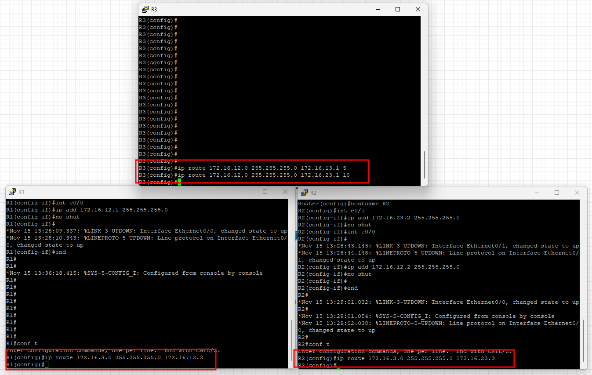

Check the routing table on each router to verify the static routes are configured correctly.

```plaintext
R1# show ip route
R2# show ip route
R3# show ip route
```

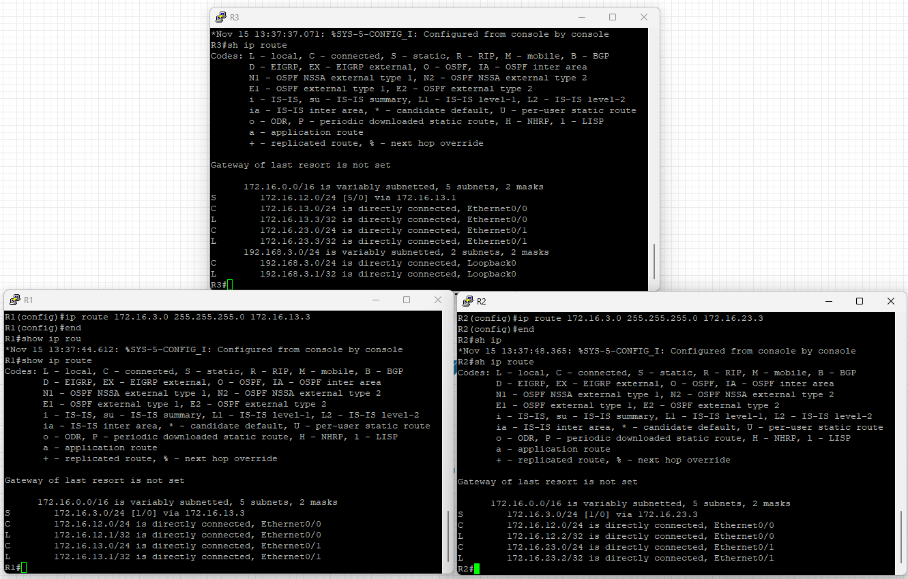

From `R1` and `R2`, you should be able to ping the `172.16.3.1`.

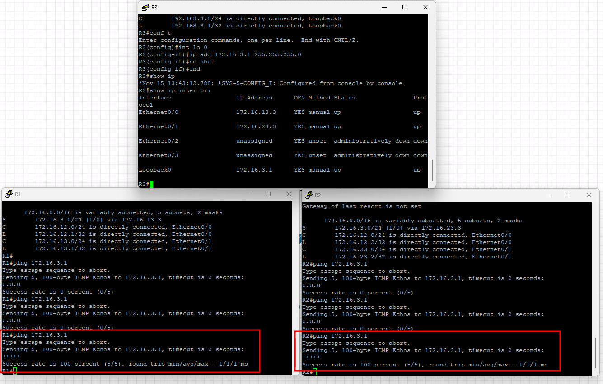

### Step 3: Configure HSRP

Configure HSRP on `R1` and `R2` to provide redundancy for the network. Use the following settings:

```plaintext
R1(config)# interface e0/0
R1(config-if)# standby 1 ip 172.16.12.254
R1(config-if)# standby 1 priority 150
R1(config-if)# standby 1 preempt

R2(config)# interface e0/0
R2(config-if)# standby 1 ip 172.16.12.254
R2(config-if)# standby 1 preempt
```

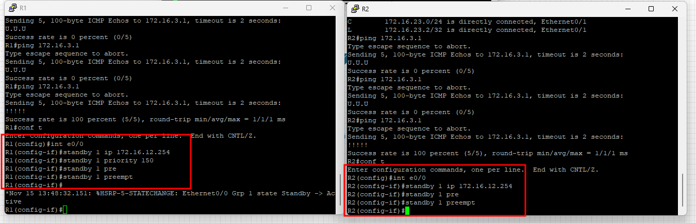

### Step 4: Verify HSRP

Check the HSRP status on `R1` and `R2` to verify that the routers are working together in a group.

```plaintext
R1# show standby brief

R2# show standby brief
```

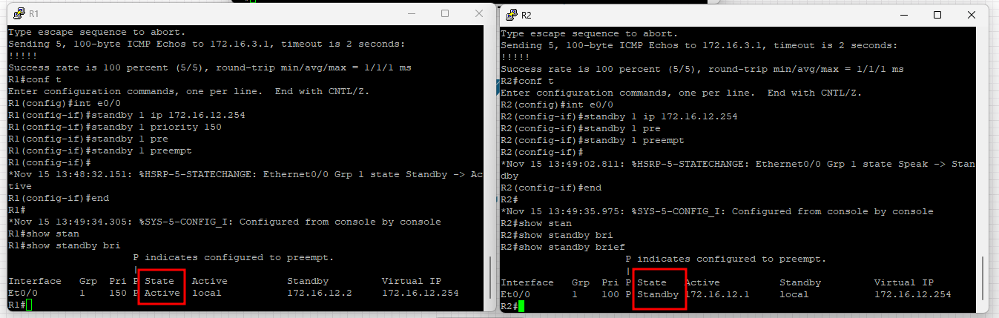

From `PC`, set the default gateway to `172.16.12.254` - the virtual IP address configured for HSRP and try to ping `172.16.3.1` - the IP address of Loopback0 on `R3`.

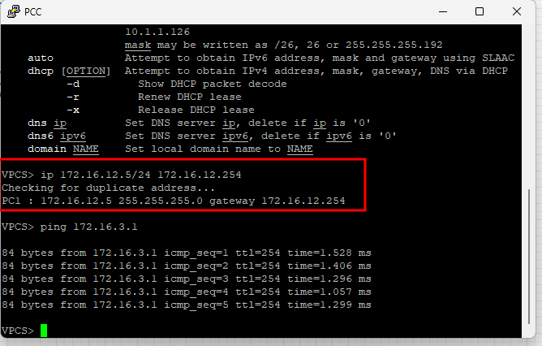

The ARP table on `PC` should show the virtual MAC address `00:00:0c:07:ac:01` for the virtual IP address `172.16.12.254`.

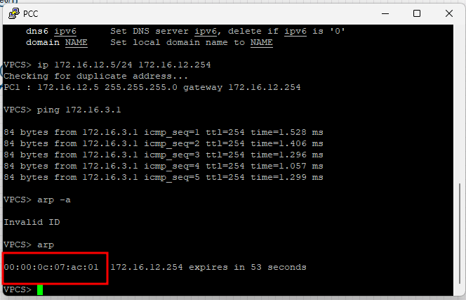

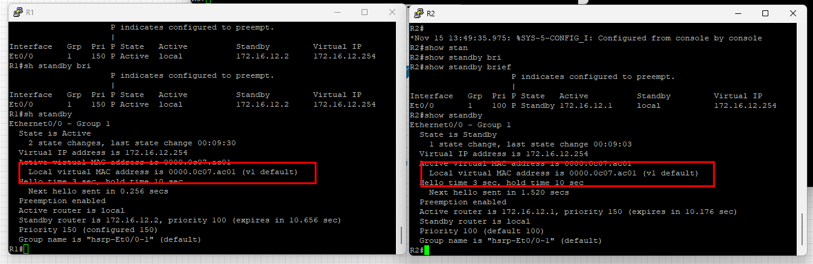

Try to shut down the interface `e0/0` and `e0/1` on `R1` and check the HSRP status on `R1` and `R2`.

```plaintext
R1(config)# interface e0/0
R1(config-if)# shutdown

R1(config)# interface e0/1
R1(config-if)# shutdown
```

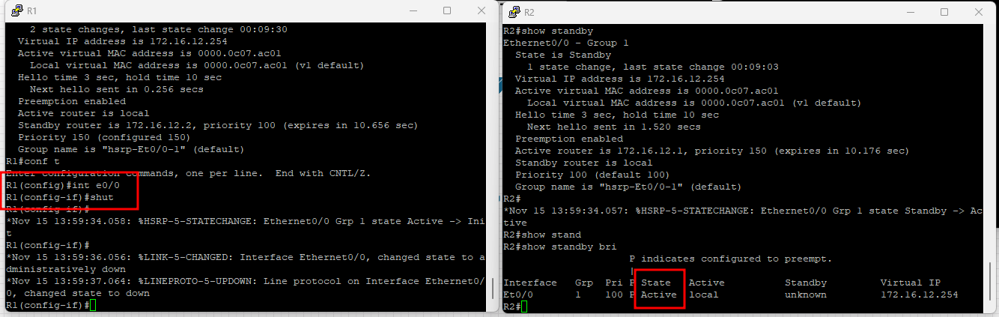

The `PC` can be also able to ping the `172.16.3.1` without any interruption through `R2`.

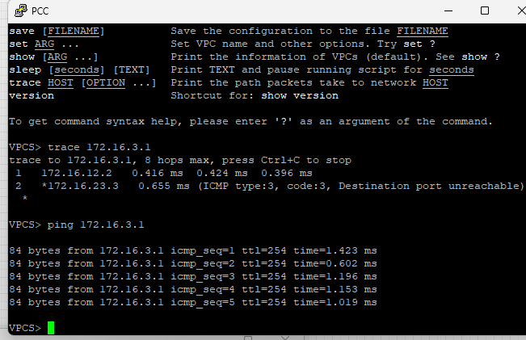
