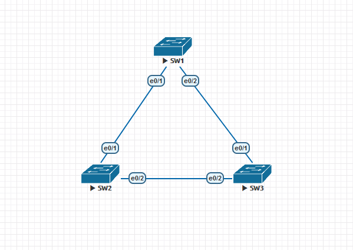
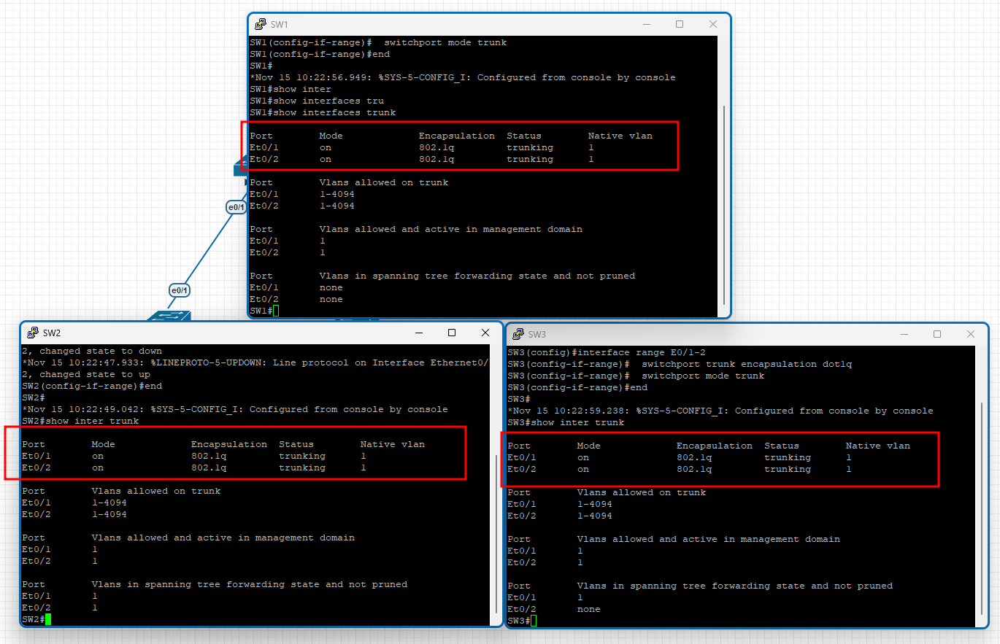
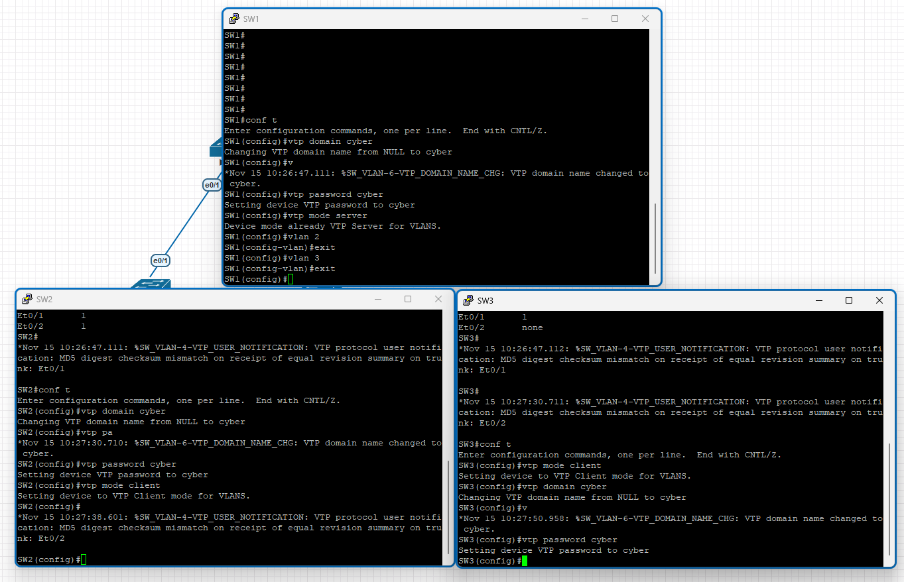
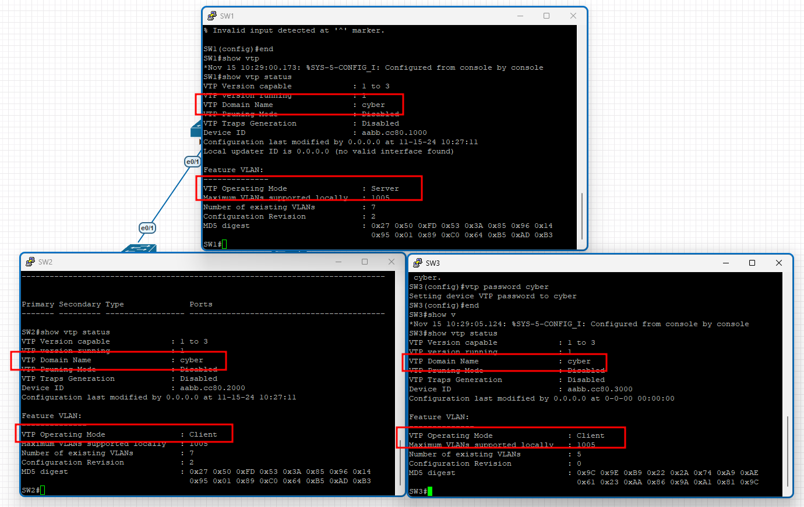
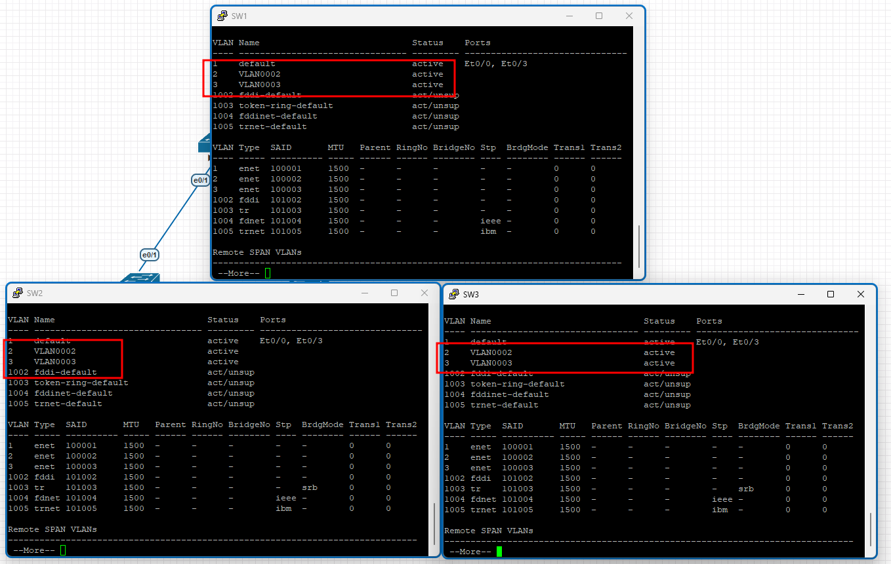
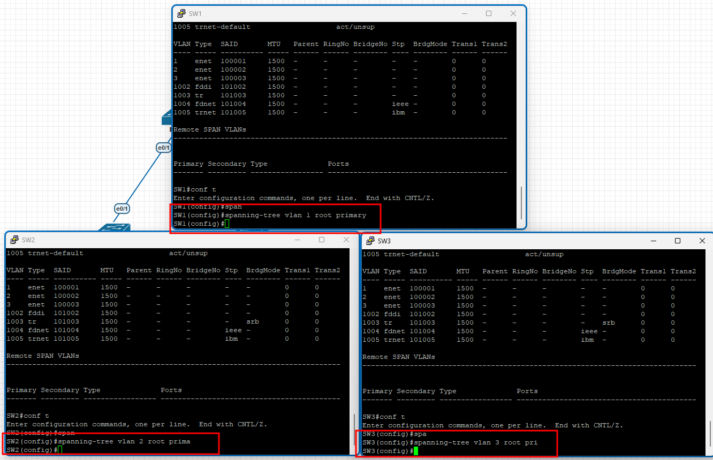
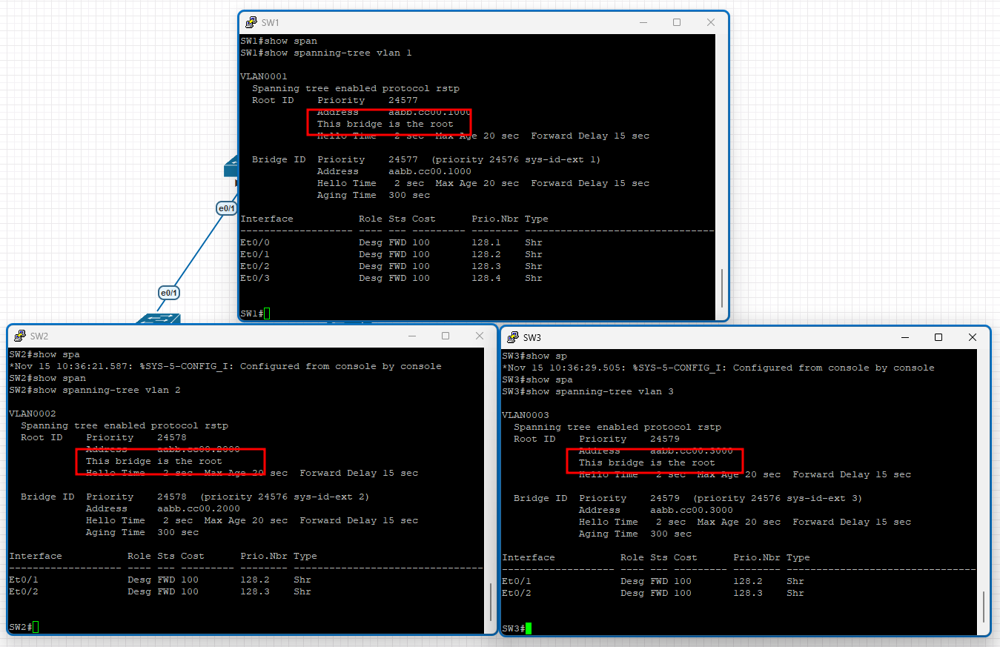

# STP - Spanning Tree Protocol

## What is STP?

STP is a network protocol that builds a loop-free logical topology for Ethernet networks. The basic function of STP is to prevent bridge loops and the broadcast radiation that results from them. Broadcast radiation occurs when a broadcast packet is sent over a network and almost every device on the network receives and processes the packet. This can cause network congestion and slow performance.

## How does STP work?

STP works by selecting a single root bridge that becomes the root of the logical tree. The root bridge is the bridge with the lowest bridge ID. The bridge ID is a combination of the bridge priority and the MAC address of the bridge. The bridge priority is a value between 0 and 65535, with a default value of 32768. The MAC address is a unique identifier for the bridge.

Once the root bridge is selected, STP calculates the shortest path to the root bridge for each bridge in the network. This path is called the root path cost. The root path cost is the sum of the costs of the links between the bridge and the root bridge. The cost of a link is determined by the speed of the link. For example, a 10 Mbps link has a cost of 100, a 100 Mbps link has a cost of 19, and a 1 Gbps link has a cost of 4.

STP then selects a single root port on each bridge that has the lowest root path cost to the root bridge. The root port is the port that is closest to the root bridge. If there are multiple ports with the same root path cost, the port with the lowest port ID is selected.

STP also selects a single designated port on each segment that has the lowest root path cost to the root bridge. The designated port is the port that is closest to the root bridge on the segment. If there are multiple ports with the same root path cost, the port with the lowest port ID is selected.

STP then blocks all other ports on each bridge to prevent loops in the network. The blocked ports are put into a blocking state and do not forward traffic.

## Requirements / Objectives

- Basic Switch Configuration
- Configure Trunk Ports between Switches for VLANs
- Configure VLANs and VTP
  - VTP domain: `cyber`
  - VTP password: `cyber`
  - VTP server: `SW1`
  - VTP clients: `SW2`, `SW3`
  - VPN 2, 3 on `SW1`
- Configure STP
  - `SW1` is the root switch for VLAN 1
  - `SW2` is the root switch for VLAN 2 and the backup root switch for VLAN 1
  - `SW3` is the root switch for VLAN 3
  - VLAN 1: Port E0/1 on `SW3` is blocked

## Topology



## Instructions

### 1. Configure the basic switch settings on all switches

### 2. Configure trunk ports between the switches for VLANs

Configure the trunk ports between the switches for VLANs. The trunk ports should be configured with the following settings:

```plaintext
SW1:
interface range E0/1-2
  switchport trunk encapsulation dot1q
  switchport mode trunk

SW2:
interface range E0/1-2
  switchport trunk encapsulation dot1q
  switchport mode trunk

SW3:
interface range E0/1-2
  switchport trunk encapsulation dot1q
  switchport mode trunk
```

Check the trunk ports on all switches:

```plaintext
SW1# show interfaces trunk

SW2# show interfaces trunk

SW3# show interfaces trunk
```



### 3. Configure VLANs and VTP

Configure the VLANs and VTP on all switches. The VTP domain should be `cyber` with a password of `cyber`. `SW1` should be the VTP server, and `SW2` and `SW3` should be VTP clients. VLANs 2 and 3 should be configured on `SW1`.

```plaintext
SW1(config)# vtp domain cyber
SW1(config)# vtp password cyber
SW1(config)# vtp mode server
SW1(config)# vlan 2
SW1(config-vlan)# exit
SW1(config)# vlan 3
SW1(config-vlan)# exit

SW2(config)# vtp domain cyber
SW2(config)# vtp password cyber
SW2(config)# vtp mode client

SW3(config)# vtp domain cyber
SW3(config)# vtp password cyber
SW3(config)# vtp mode client
```



Check the VTP status on all switches:

```plaintext
SW1# show vtp status

SW2# show vtp status

SW3# show vtp status
```



Check the VLANs on all switches and ensure that VLANs 2 and 3 are synchronized from `SW1` to `SW2` and `SW3`:

```plaintext
SW1# show vlan

SW2# show vlan

SW3# show vlan
```



### 4. Configure STP root switches

Configure the STP root switches on all switches. `SW1` should be the root switch for VLAN 1, `SW2` should be the root switch for VLAN 2, and `SW3` should be the root switch for VLAN 3. `SW2` should also be the backup root switch for VLAN 1.

```plaintext
SW1(config)# spanning-tree vlan 1 root primary

SW2(config)# spanning-tree vlan 2 root primary
SW2(config)# spanning-tree vlan 1 root secondary

SW3(config)# spanning-tree vlan 3 root primary
```



Check the STP status on all switches:

```plaintext
SW1# show spanning-tree vlan 1

SW2# show spanning-tree vlan 2

SW3# show spanning-tree vlan 3
```



### 5. Block the port on `SW3` for VLAN 1

Block the port E0/1 on `SW3` for VLAN 1:

```plaintext
SW3(config)# interface E0/1
SW3(config-if)# spanning-tree vlan 1 cost 39
```
