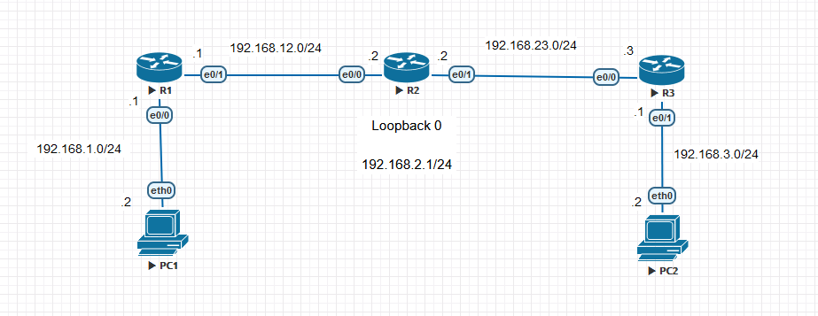

# Static Routing

## Objectives

- Configure static routes
- Ensure connectivity between routers and PCs using static routes

## Topology

## Instructions

### 1. Configure the IP addresses on the routers and PCs as shown in the topology.

### 2. Configure static routes on the routers as shown in the topology.
