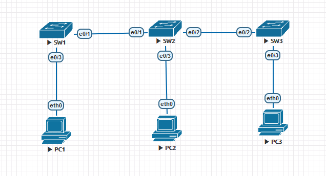
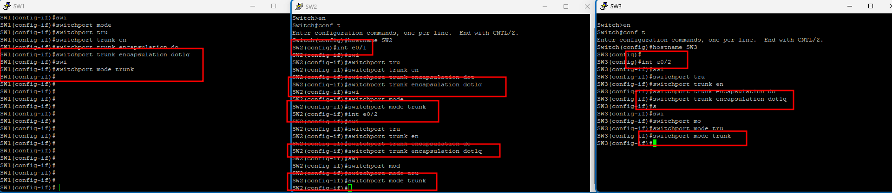
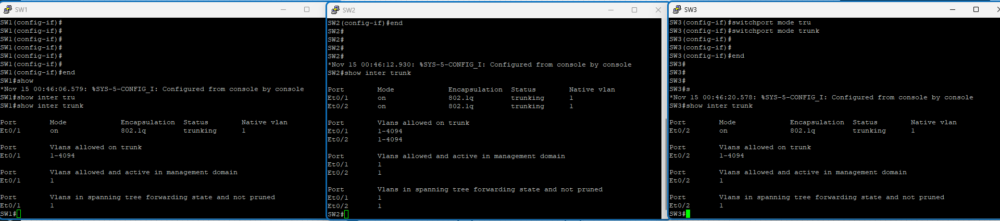
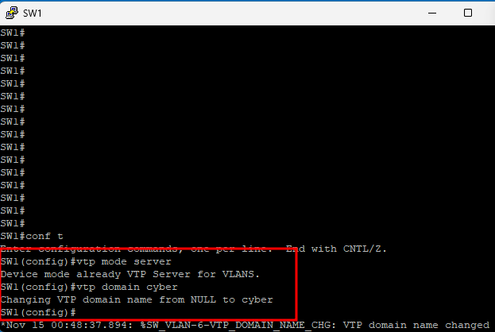
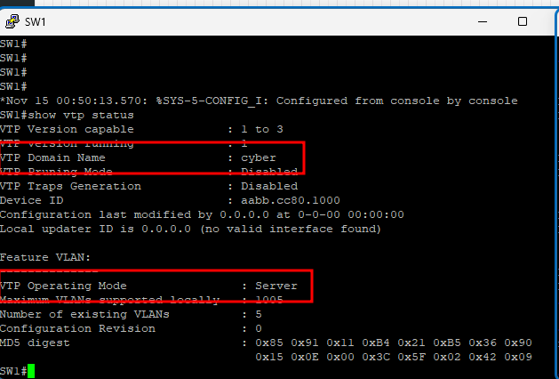
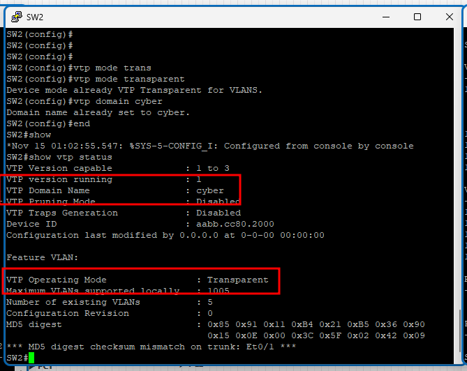
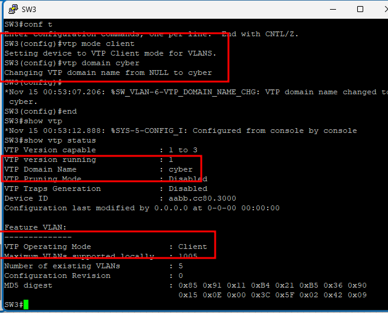
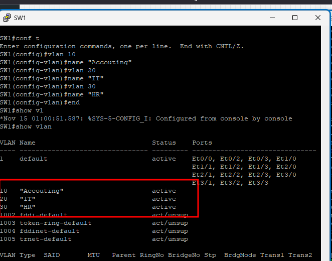
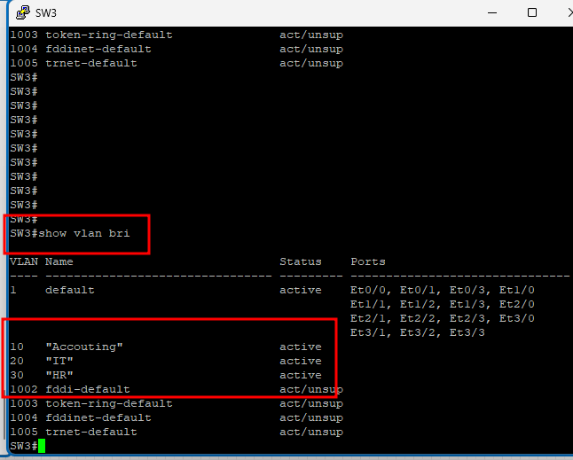

# Configure VLAN, Trunking, VTP

## Objectives

- Basic Switch Configuration
- VLAN Configuration on Switch and Trunking between Switches
- VTP Configuration
  - SW1: VTP Server
  - SW2: Transparent
  - SW3: Client
  - VTP domain: `cyber`

## Topology



## Instructions

### 1. Basic Switch Configuration

### 2. Trunking between Switches

Configure trunking between SW1 and SW2, SW2 and SW3.

```plaintext
SW1:
interface Ethernet0/1
    switchport trunk encapsulation dot1q <- For newer switches, this is the default
    switchport mode trunk

SW2:
interface Ethernet0/1
    switchport trunk encapsulation dot1q
    switchport mode trunk
interface Ethernet0/2
    switchport trunk encapsulation dot1q
    switchport mode trunk

SW3:
interface Ethernet0/2
    switchport trunk encapsulation dot1q
    switchport mode trunk
```



Show the trunking status on SW1, SW2, and SW3.

```plaintext
SW1# show interfaces trunk
```



### 3. VTP Configuration

Configure VTP server on SW1.

```plaintext
SW1:
vtp mode server
vtp domain cyber
vtp password cisco <- Optional
```



Show the VTP configuration on SW1.

```plaintext
SW1# show vtp status
```



Configure VTP transparent on SW2.

```plaintext
SW2:
vtp mode transparent
vtp domain cyber
vt password cisco <- Same as the server
```



Configure VTP client on SW3.

```plaintext
SW3:
vtp mode client
vtp domain cyber
vt password cisco <- Same as the server
```



### 4. VLAN Configuration and Synchronization

Create VLANs on SW1.

```plaintext
SW1:
vlan 10
    name "Accounting"
vlan 20
    name "IT"
vlan 30
    name "HR"
```



Check the VLAN information synchronized on SW3.

```plaintext
SW3# show vlan brief
```



> On SW2 - Transparent, the VLANs are not synchronized.

Create VLANs on SW2.

```plaintext
SW2:
vlan 10
vlan 20
```

### 5. Assigning VLANs to Ports

Assign VLANs to ports on SW1.

```plaintext
SW1, SW2, SW3:
interface range e0/3, e0/4
    switchport mode access <- Default is dynamic auto
    switchport access vlan 10
interface range e1/0, e1/4
    switchport mode access
    switchport access vlan 20
interface range e2/0, e2/4
    switchport mode access
    switchport access vlan 30
```
