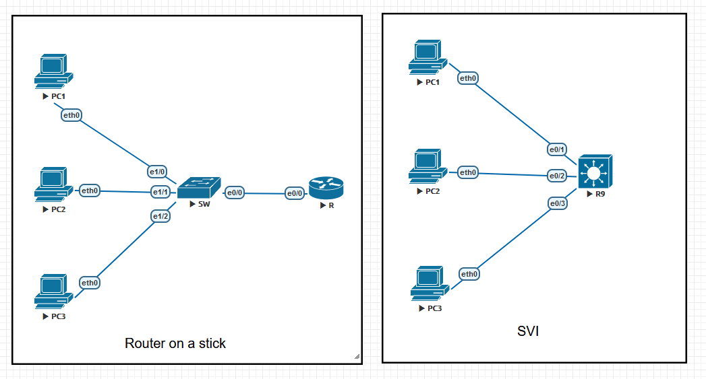
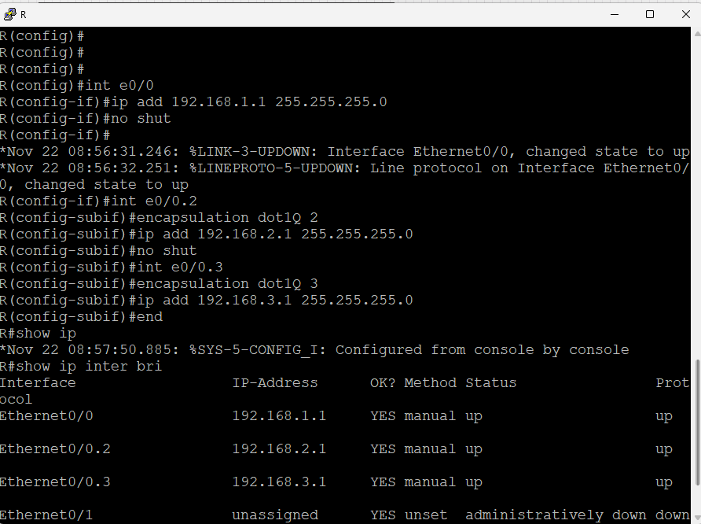
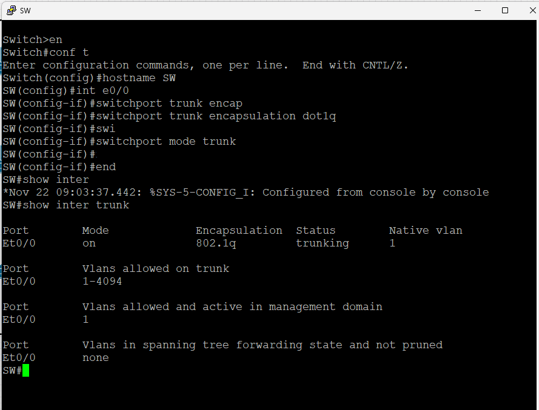
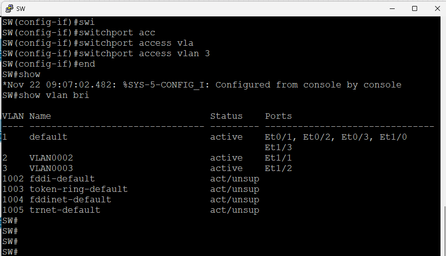
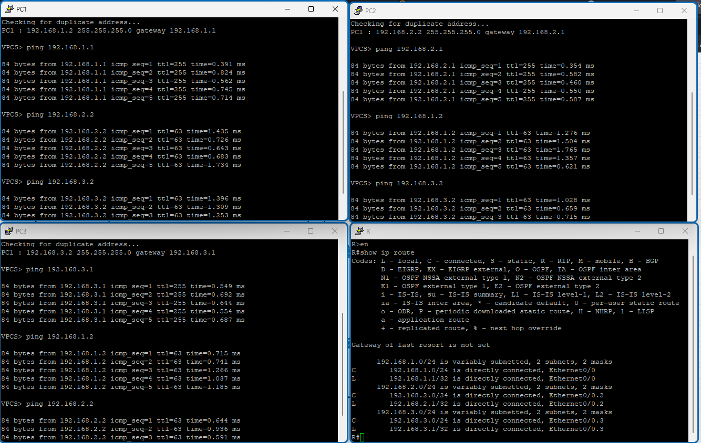
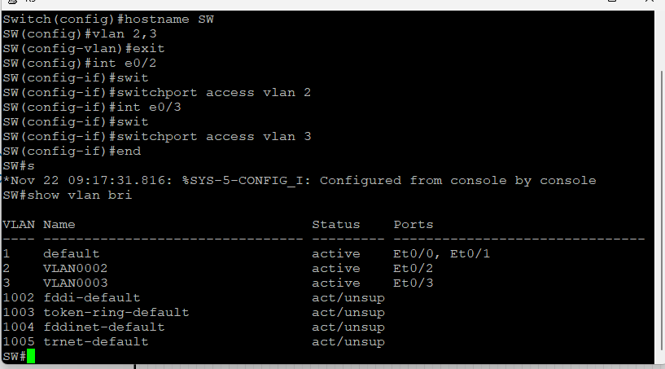
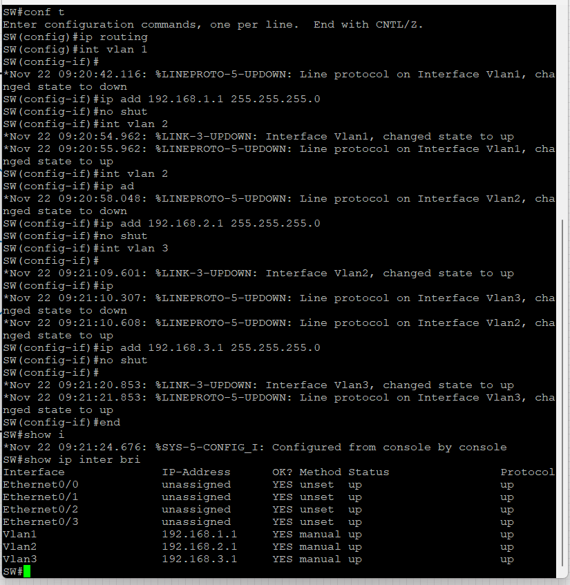
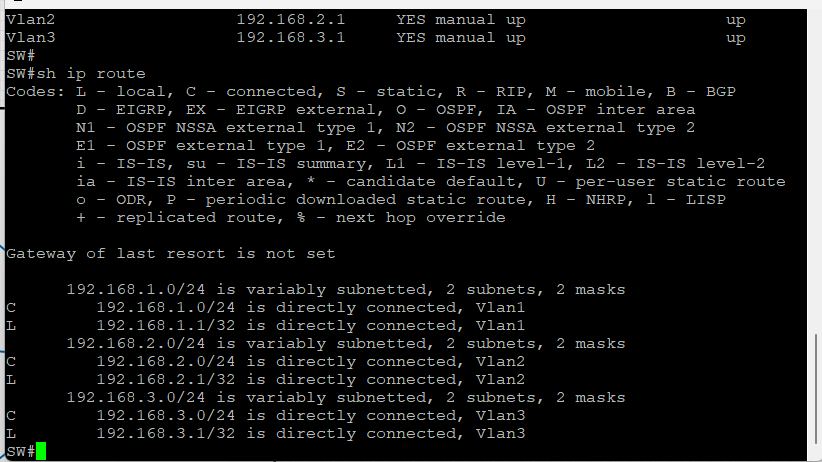
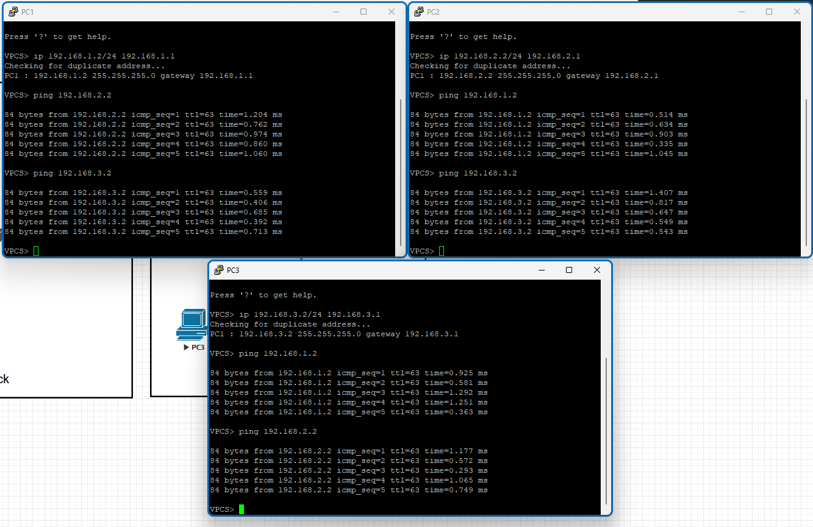

# VLAN Routing

## Objectives

- Configure VLANs on switches
- Configure a router-on-a-stick
- Configure SVIs on a switch for inter-VLAN routing

## Topology



## Instructions

### Part 1: Configure VLANs on switches

Configure VLANs and assign ports to VLANs on the switches.

### Part 2: Configure a router-on-a-stick

IP addressing table

| Device | Interface | IP Address | Subnet Mask | Default Gateway | Notes |
| ------ | --------- | ---------- | ----------- | --------------- | ----- |
| R1     | E0/0     | 192.168.1.1 | 255.255.255.0 | N/A | Default gateway for VLAN 1 |
|        | E0/0.2   | 192.168.2.1 | 255.255.255.0 | N/A | Default gateway for VLAN 2 |
|        | E0/0.3   | 192.168.3.1 | 255.255.255.0 | N/A | Default gateway for VLAN 3 |
| S1     | VLAN 1   | 192.168.1.251 | 255.255.255.0 | N/A | Management |
| PC1    | NIC      | 192.168.1.2 | 255.255.255.0 | 192.168.1.1 | N/A |
| PC2    | NIC      | 192.168.2.2 | 255.255.255.0 | 192.168.2.1 | N/A |
| PC3    | NIC      | 192.168.3.2 | 255.255.255.0 | 192.168.3.1 | N/A |

Configure all devices with the IP addresses listed in the IP addressing table.

Create a sub-interface on R1 for each VLAN. Configure the sub-interface with the IP address and encapsulation dot1Q.

```plaintext
R1(config)# interface e0/0 <- Native VLAN 1
R1(config-if)# no shutdown
R1(config-if)# ip address 192.168.1.1 255.255.255.0
R1(config-if)# exit
R1(config)# interface e0/0.2
R1(config-if)# encapsulation dot1Q 2
R1(config-if)# ip address 192.168.2.1 255.255.255.0
R1(config-if)# exit
R1(config)# interface e0/0.3
R1(config-if)# encapsulation dot1Q 3
R1(config-if)# ip address 192.168.3.1 255.255.255.0
R1(config-if)# exit
```

> Check the configuration of the sub-interfaces using the `show ip interface brief` command.



For VLAN 1, because it is a native VLAN, we use physical port e0/0 to communicate between the router and the hosts belonging to VLAN 1.

Configure trunking on the switch port connected to the router.

```plaintext
S1(config)# interface e0/0
S1(config-if)# switchport trunk encapsulation dot1q
S1(config-if)# switchport mode trunk
```

Check the trunk configuration using the `show interfaces trunk` command.

```plaintext
S1# show interfaces trunk
```



Assign the VLAN for each port on the switch.



Check the routing table on R1 using the `show ip route` command. And then ping to check the connection between the PCs.



### Part 3: Configure SVIs on a switch for inter-VLAN routing

Assign VLAN for each port on the switch.



**Enable routing on the switch.**

```plaintext
SW1(config)# ip routing
```

**Create a VLAN interface for each VLAN.**

```plaintext
SW1(config)# interface vlan 1
SW1(config-if)# ip address 192.168.1.1 255.255.255.0
SW1(config-if)# no shutdown

SW1(config)# interface vlan 2
SW1(config-if)# ip address 192.168.2.1 255.255.255.0
SW1(config-if)# no shutdown

SW1(config)# interface vlan 3
SW1(config-if)# ip address 192.168.3.1 255.255.255.0
SW1(config-if)# no shutdown
```

Check the interface status using the `show ip interface brief` command.



Show the inter-VLAN routing table using the `show ip route` command.



Ping between the PCs to check the connection.


